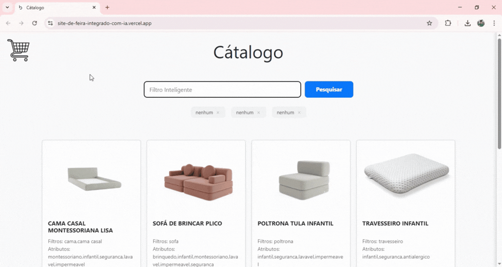

# 🧸 Bell'Baby - Intelligent Semantic Search & WhatsApp Checkout

This project is an e-commerce solution that uses Artificial Intelligence to transform informal searches into precise technical filters, focusing on a fluid and humanized shopping experience for the Bell'Baby catalog.

## 📸 Demo

  
  
<i>Adaptive interface focusing on mobile usability and contextual search.</i>

## 🚀 Main Features

- **AI Semantic Search:** The system interprets the search context.
  - *Example:* "Child playing with water" → Automatically returns `['infant', 'waterproof', 'washable']`.
- **Fallback System (Resilience):** If the primary AI model (`Gemini 3.1 Flash Lite`) shows instability or reaches the quota, the system automatically switches to `Gemini 2.5 Flash` without interrupting the user's navigation.
- **WhatsApp Cart:** Integration that converts selected items into a structured message, sending the complete order directly to the store's WhatsApp for human sale finalization.
- **Dynamic Filters:** Automatic classification by Categories (sofas, beds), Attributes, and specific Models.

## 🛠️ Tech Stack

- **Backend:** Python with direct integration with the Google Generative AI API.
- **Frontend:** HTML5, CSS3, and JavaScript (focusing on performance and Vanilla JS).
- **Security:** Use of the `ast` library for validating AI-generated data.
- **Deploy:** Render (Continuous Integration).

## 🧠 Development Challenges

This project was developed over **5 days** of intense work. During the process, my main points of learning and difficulty were:

1. **Responsiveness:** I had a lot of difficulty making the site fully responsive, ensuring that the filter sidebar worked well on small screens with an escape area (gap) for the user.
2. **Deploy:** Vercel 
3. **Prompt Engineering:** Refining the AI instructions so that it would not "hallucinate" and would stay strictly within the store's business rules.

Although Frontend is not my strongest suit, this project allowed me to evolve significantly in this area, in addition to consolidating knowledge in infrastructure and AI.